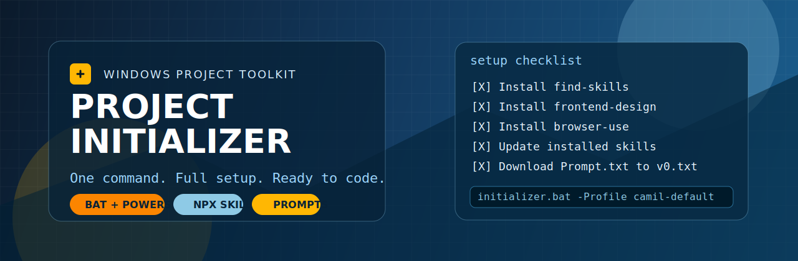

# Project Initializer (Cross-platform)

Inicializador de proyectos para Windows, Linux y macOS con menu interactivo, perfiles de instalacion, modo no interactivo y logging.

Objetivo: dejar un entorno base preconfigurado en minutos para empezar a trabajar sin repetir setup manual.

## Que incluye

- Launcher en BAT para Windows y launcher SH para Linux/macOS.
- Script principal en PowerShell para logica y orquestacion.
- Configuracion externa en JSON (tasks, perfiles, fuentes de prompts).
- Seleccion interactiva por teclado y ejecucion por lotes.
- Reintentos automaticos en fallos transitorios de red/comandos.
- Logs por ejecucion en carpeta logs.
- Modo remoto efimero desde terminal (sin clonar ni dejar archivos en el repo).

## Arquitectura

- initializer.bat: launcher minimal.
- initializer.sh: launcher POSIX con modo local/remoto.
- initializer.ps1: motor principal.
- initializer.config.json: tareas y perfiles.
- prompts/v0.txt: prompt descargado (se crea durante la ejecucion).
- logs/: salida de cada corrida.

## Requisitos

- Windows (CMD o PowerShell) o Linux/macOS (bash/zsh)
- PowerShell disponible en PATH (`pwsh` o `powershell.exe`)
- Node.js (incluye npx)
- Conexion a internet

## Perfil principal del usuario

El perfil camil-default viene incluido y selecciona exactamente:

- Install find-skills
- Install vercel-react-best-practices
- Install web-design-guidelines
- Install frontend-design
- Install skill-creator
- Install vercel-composition-patterns
- Install ai-image-generation
- Install ui-ux-pro-max
- Install browser-use
- Update installed skills
- Download Prompt.txt to prompts/v0.txt

## Uso interactivo

Ejecutar:

```bat
initializer.bat
```

En Linux/macOS:

```bash
bash initializer.sh
```

Controles:

- Up/Down: mover cursor
- Space: marcar/desmarcar item
- A: seleccionar todo
- N: deseleccionar todo
- P: cambiar perfil activo
- Enter: ejecutar seleccion

## Uso no interactivo

Ejemplos:

```bat
initializer.bat -NonInteractive -Profile camil-default
initializer.bat -NonInteractive -All
initializer.bat -NonInteractive -PromptOnly
initializer.bat -NonInteractive -Profile camil-default -AllowHighRisk
initializer.bat -NonInteractive -Profile camil-default -Retries 3
```

Equivalente en Linux/macOS:

```bash
bash initializer.sh -NonInteractive -Profile camil-default
bash initializer.sh -NonInteractive -All
bash initializer.sh -NonInteractive -PromptOnly
bash initializer.sh -NonInteractive -Profile camil-default -AllowHighRisk
bash initializer.sh -NonInteractive -Profile camil-default -Retries 3
```

## Ejecucion remota sin ensuciar el proyecto

Si queres correrlo desde terminal sin clonar el repo ni dejar archivos en tu carpeta actual:

```bash
curl -fsSL https://raw.githubusercontent.com/Recamm/Project-Initializer/main/initializer.sh | bash -s -- --remote -NonInteractive -Profile camil-default
```

Notas:

- Descarga `initializer.ps1` y `initializer.config.json` a una carpeta temporal.
- Ejecuta todo desde ahi y elimina esa carpeta al terminar.
- Tambien podes pasar cualquier parametro soportado por el script.

Parametros principales:

- -Profile <nombre>: perfil de tareas
- -All: selecciona todo
- -PromptOnly: ejecuta solo descarga de prompts
- -NonInteractive: sin menu
- -AllowHighRisk: permite instalar tareas marcadas como high risk sin confirmacion
- -Retries <n>: cantidad de reintentos ante fallo

## Seguridad

Cuando una tarea tiene riskHint=high:

- En modo interactivo: pide confirmacion explicita antes de ejecutar.
- En modo no interactivo: se salta por defecto, salvo que uses -AllowHighRisk.

Ademas, el resumen final muestra linea Retry para re-ejecutar fallos puntuales.

## Personalizacion

Editar initializer.config.json para:

- Agregar o quitar tasks
- Cambiar links de repositorio/skills
- Ajustar riskHint
- Definir nuevos perfiles
- Actualizar fuentes de Prompt.txt

## Logs y diagnostico

Cada ejecucion genera un log en logs/ con timestamp.

Si algo falla:

- Revisar el resumen [FAIL]
- Copiar y ejecutar la linea Retry
- Revisar el log correspondiente

## Aviso de IA y responsabilidad

Este proyecto fue generado y ajustado con ayuda de inteligencia artificial.

Lo comparto con fines de aprendizaje e interes propio.

No asumo responsabilidad por consecuencias derivadas de su uso, instalacion, modificacion o ejecucion en entornos de terceros o de produccion.